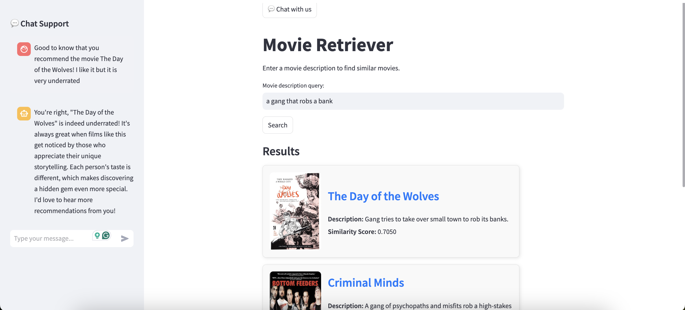

# Movies-Recommender
This repository contains a movie recommender application that provides personalized movie recommendations based on user preferences and text-based queries. The system also integrates a chatbot for interactive recommendations.

## Features

1. **User-Based Collaborative Filtering**: Recommends movies based on a user's rating history compared to other users.
2. **Content-Based Filtering**: Suggests movies with plots similar to user-provided text input.
3. **Interactive Chatbot**: Engages with users to provide recommendations and contextual movie-related information.

## Architecture Overview

### Core Modules

#### 1. Movie Recommender
The **MovieRecommender** class leverages Retrieval-Augmented Generation (RAG) techniques to retrieve movies with relevant plots and descriptions. It utilizes **SentenceTransformers embeddings** to store and search movie descriptions efficiently within a vector database.

#### 2. Chatbot
The **Chatbot** class processes user queries, incorporating chat history to generate contextual responses. It employs the **Deepseek-R1 model**, optimized and served via **Ollama**, for inference.

### API
The backend is powered by **FastAPI**, exposing REST endpoints to facilitate interaction between the frontend and recommendation models.

### Frontend
The user interface is built with **Streamlit**, enabling an interactive and user-friendly experience for exploring recommendations and interacting with the chatbot.

## Development Roadmap

### 1. Minimum Viable Product (MVP) ✅
- [x] Build a vector database and integrate RAG using a small dataset.
- [x] Implement an LLM-powered chatbot for user interaction.
- [x] Develop FastAPI endpoints to handle API requests.
- [x] Create a functional Streamlit UI.

### 2. Expanding the Dataset 🔄
- [ ] Integrate the **MovieLens dataset** to enrich user preference data.
- [ ] Scrape additional movie elements (actors, plots, genres, etc.) to enhance recommendations.
- [ ] Transition from CSV-based storage to **SQL and vector databases** for better scalability.

### 3. Improving Chatbot Intelligence 🔄
- [ ] Implement an **NER (Named Entity Recognition) model** to extract keywords from user queries, enhancing RAG-based retrieval.
- [ ] Develop a **query/response validation or self-reflection module** to avoid chatbot hallucinations.

### 4. Enhancing Recommendation System 🔄
- [ ] Implement **collaborative filtering** for personalized recommendations.
- [ ] Apply **clustering techniques** to group similar users and movies.

### 5. Optimizing the RAG System 🔄
- [ ] Improve **plot chunking strategies** to enhance retrieval accuracy.
- [ ] Experiment with incorporating additional movie metadata into descriptions.
- [ ] Further refinements (To Be Determined).

## How to Run the Application

### Prerequisites
Ensure you have the following installed:
- Python 3.11
- FastAPI
- Streamlit
- langchain_community
- SentenceTransformers
- Ollama (for Deepseek-R1 inference)
- Chromadb as vector database

### Setup

🚧 Coming Soon 🚧

### Contact

For any questions, feedback or ideas, feel free to reach out by email!